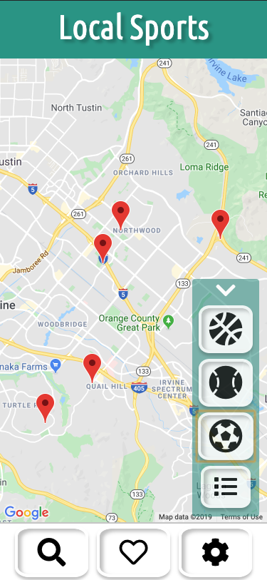

[Work in Progress]

## local-sports

A web app for athletes who want to find local pick-up sporting events.

Mobile First 

## Technologies
- React.js
- Webpack4
- Babel
- Node
- HTML5
- CSS3
- BootStrap
- AWS EC2

## Feature List 
- User can create an account to sign in 
- User can sign in to their account
- User can search for a sport by icons
- User can see their selected sport as markers on a map
- User can see their selected sport as a list
- User can see more detailed information about an event
- User can see reviews about a specific event 
- User can see their liked events
- User can set their schedule to refine their search
- User can sign out

## Demo
A live functional version can be seen at: https://localsports.site

## Example 

## Development
Instructions coming soon ... 
 
 
Maintained by `tcormons`
