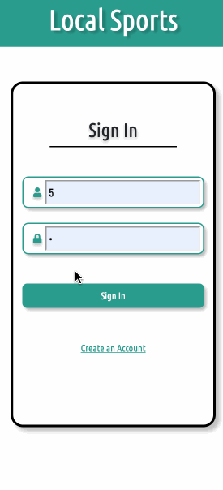

[Work in Progress]

## local-sports

A web app for athletes who want to find local pick-up sporting events.

Mobile First 

## Figma
Link: https://github.com/kevinakahoshi/cyberpunk-logo-match

## DB Design
Link: https://dbdesigner.page.link/2o3e

## MeisterTask
Link: https://www.meistertask.com/app/project/vYNbbEvR/ls-local-sports

## Technologies
- React.js
- Webpack4
- Babel
- Node
- HTML5
- CSS3
- BootStrap
- AWS EC2

## Feature List 
- User can create an account to sign in 
- User can sign in to their account
- User can search for a sport by icons
- User can see their selected sport as markers on a map
- User can see their selected sport as a list
- User can see more detailed information about an event
- User can see reviews about a specific event 
- User can see their liked events
- User can set their schedule to refine their search
- User can sign out

## Demo
A live functional version can be seen at: https://localsports.site

## Example 

  
## Development
### System Requirements
- NPM 6 or higher
- MYSQL 7 or higher

### Inital Setup
- Clone Repository History
`git clone https://github.com/Tcormons/local-sports.git`

- Install dependencies for NPM
`npm install`

- Import the database for MYSQL
`npm run db:import`

- Run Dev enviornment
`npm run dev`

### localhost:3000

Maintained by `tcormons`
